# Diagram Style Guide

An opinionated guide for creating clear, consistent, and effective technical diagrams.

## Introduction

This guide provides practical principles and techniques for creating *clear, consistent, and effective technical diagrams*. Whether you're a product manager, developer, project manager, or technical professional, these guidelines will help you transform complex ideas into accessible visual communications.

Technical diagrams excel where text often falls short—they quickly convey complex relationships, system architectures, and process flows. The principles outlined here are actionable tools you can immediately apply to improve the clarity and impact of your technical communications.

While examples throughout this guide use [draw.io](https://draw.io), these concepts can be implemented in any diagramming tool you prefer. The focus is on universal principles that transcend specific software platforms. 

## General Principles

Effective technical diagrams prioritize clarity and understanding above all else. The goal is to communicate complex technical concepts in the simplest way possible, making them accessible to diverse audiences regardless of their technical background.

- **Consistency**: Maintain uniform styles, symbols, and conventions across all diagrams within a project or organization. This creates a cohesive visual language that readers can quickly learn and apply.

- **Clarity**: Choose the simplest representation that accurately conveys your message. Every element should have a clear purpose and contribute to overall understanding.

- **Relevance**: Include only essential information that directly supports your communication goal. Remove or minimize elements that don't add value to the viewer's understanding.

## Shapes

Use distinct shapes to differentiate between types of components or services in your diagrams. Simple geometric shapes work best as they're universally recognizable and easy to reproduce.

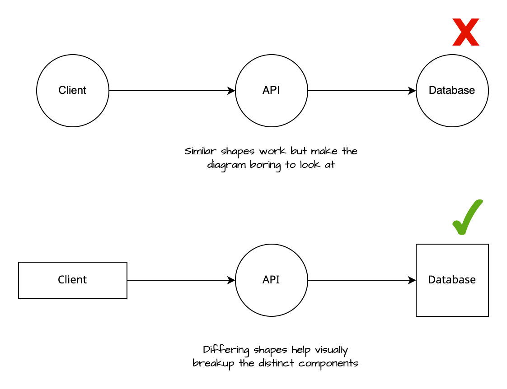

The specific shapes you choose matter less than maintaining consistency. Establish a shape vocabulary for your project—for example, if rectangles represent databases, use rectangles for all database components throughout your diagrams. This consistency helps viewers quickly identify component types and understand system relationships.

## Arrows and Lines
### Directionality

Arrows and lines communicate relationships, data flow, and system interactions. Choose a consistent approach and apply it throughout your diagrams:

1. **Data Flow**: Arrows indicate the direction data moves through the system. Example: Data flows from API to client.

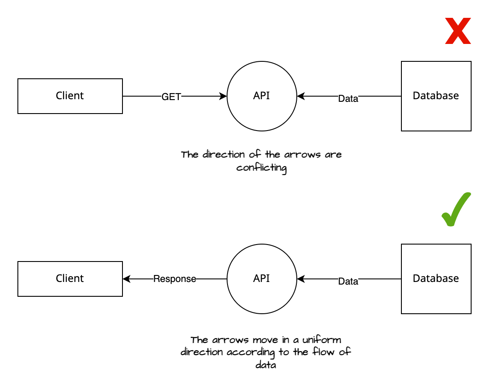

2. **Action Flow**: Arrows show the direction of actions or requests. Example: Client initiates a request to the API.

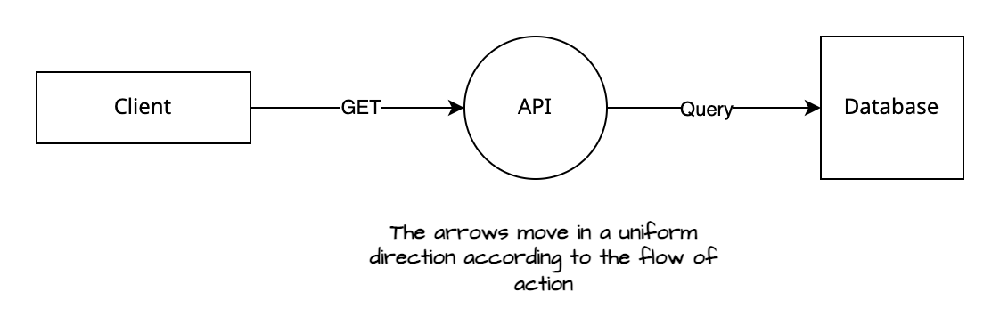

3. **System Connection**: Simple lines without arrows indicate relationships or connections between systems without implying direction. Use this when systems interact bidirectionally or when direction isn't the focus.

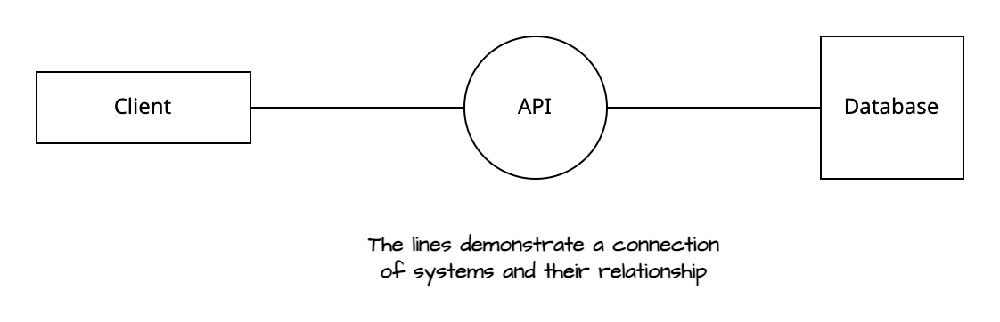

### Line Style

Use different line styles to create visual hierarchy and distinguish between primary and secondary information:

- **Primary Flow**: Solid lines for main connections and critical paths (e.g., Client → API → Database).

- **Secondary Flow**: Dashed lines for supporting processes, optional connections, or auxiliary information (e.g., authentication flows, logging, monitoring).

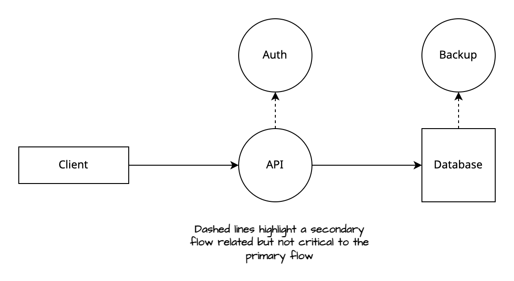

### Line Angles

Keep line paths simple and clean to maintain diagram readability:

- Avoid unnecessary multiple sharp angles in a single line connection.

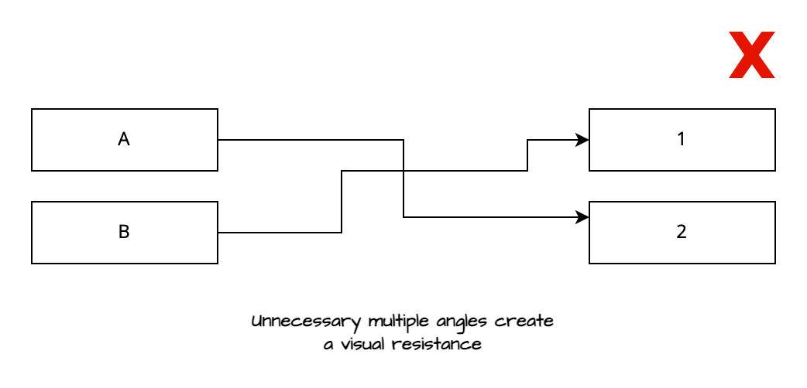

- Prefer direct, straightforward paths when connecting elements.

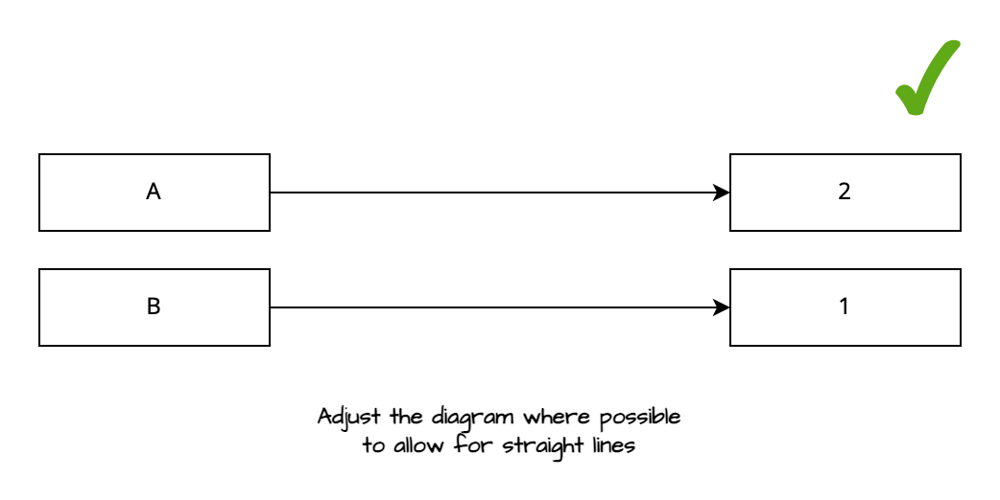

- When lines must intersect, maintain clear visual separation to prevent confusion.

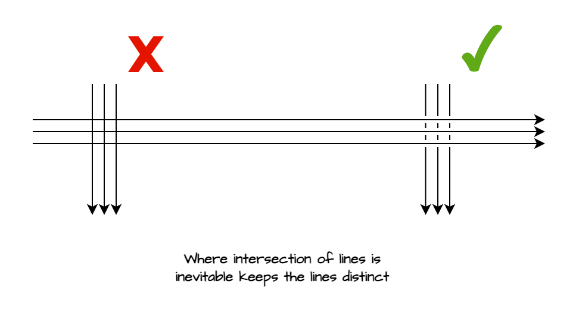

### Arrow Heads

Use different arrowhead styles to convey different types of relationships:

- **Primary Actions**: Solid arrowheads for main actions, data flow, or critical processes.

- **Secondary Relationships**: Empty or outline arrowheads for supporting connections, notes, or optional flows.

- **Combined Styles**: Combine line styles with arrowhead styles to create a comprehensive visual language for different information types.

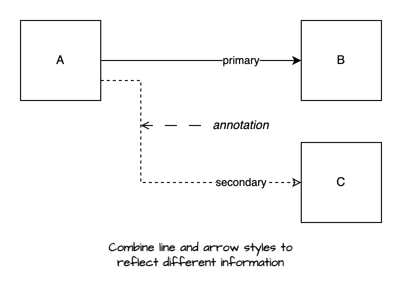

## Colour

Maintain simplicity by using a minimal colour palette—black, white, and grey form an effective foundation for most technical diagrams.

Use colour strategically to highlight critical information or indicate status. Be mindful that colours carry subconscious associations—red often suggests warnings or errors, green implies success or go-ahead, while yellow indicates caution.

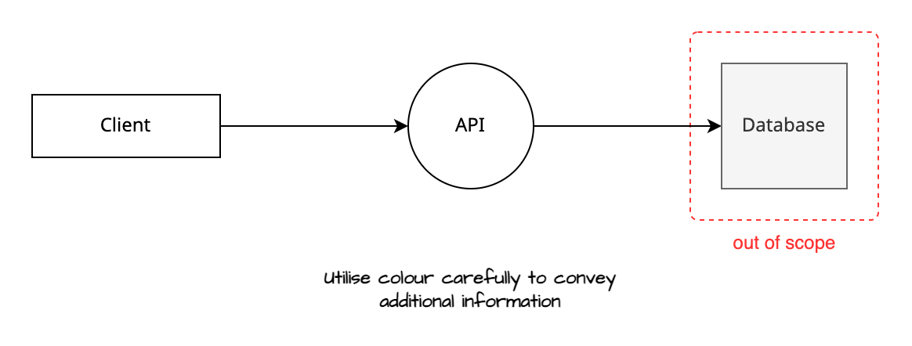

Choose colours purposefully to enhance understanding rather than decoration. When in doubt about a colour choice, consider whether the diagram communicates effectively without it.

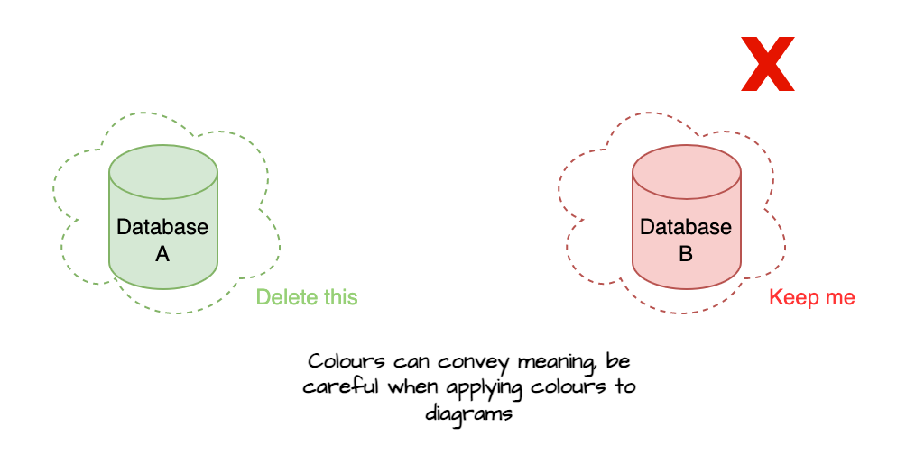

## Typography

Typography directly impacts how effectively your diagrams communicate information. Clear, consistent text choices enhance readability and professional appearance.

### Font Choices

- **Readability**: Choose fonts that remain clear at various sizes and display conditions. Sans-serif fonts like Arial, Helvetica, or Calibri are recommended for their clarity in digital formats.

- **Consistency**: Use a single font family throughout your diagrams to maintain visual cohesion and professional appearance.

- **Availability**: Select fonts that are widely available across platforms and software to ensure consistent rendering regardless of where your diagrams are viewed.

### Text Size

- **Visual Hierarchy**: Establish clear size relationships between different text elements. Titles should be largest, followed by section headers, labels, and body text. This hierarchy guides viewers through the information logically.

- **Legibility**: Ensure text remains readable at your target viewing size. For digital displays, use minimum 12-14 point text; for print, 10 points is generally acceptable.

### Labeling Conventions

- **Capitalization**: Maintain consistent capitalization rules throughout your diagrams. Choose between sentence case, title case, or uppercase for specific element types and apply consistently.

- **Abbreviations**: Use abbreviations sparingly and only when space is limited. Ensure abbreviations are widely understood or provide a legend for clarity.

The following example demonstrates inconsistent labeling that can confuse viewers:

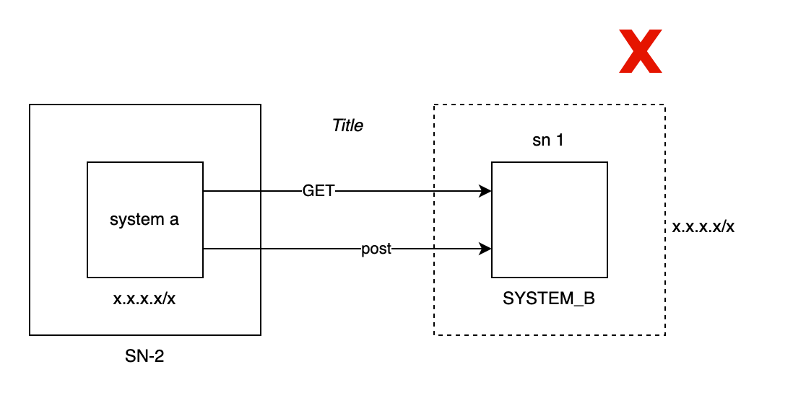

Consistent conventions improve clarity and professionalism:

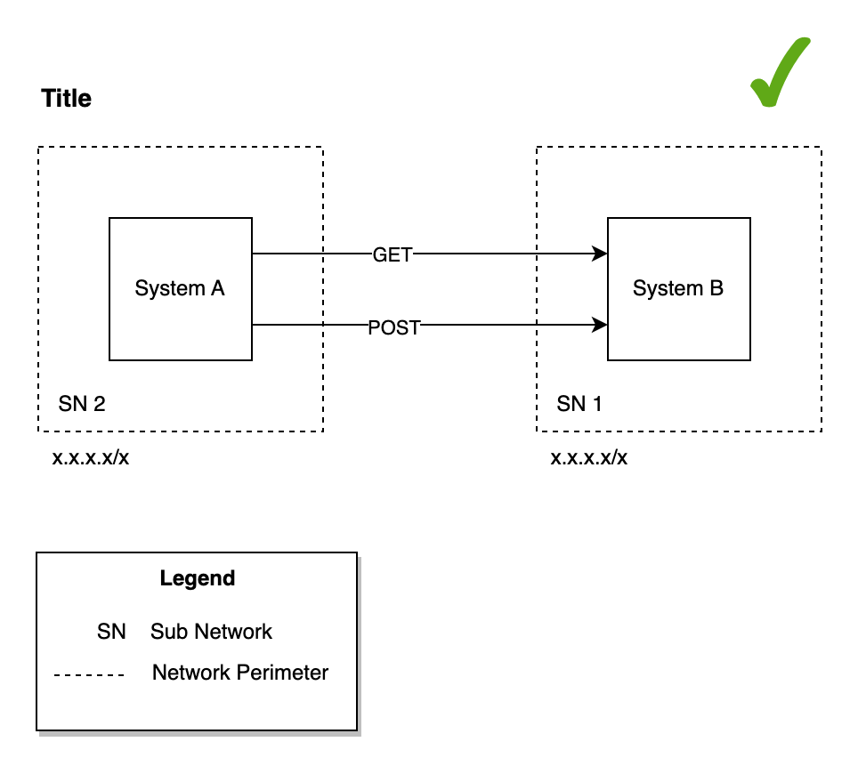

## Creativity and Aesthetics

When it comes to creativity and aesthetics, less is more. Simple design choices can help avoid overwhelming the viewer and distracting them from the main message in the diagram. 

Minimalism is Key:

- **Complexity Clutters**: Complex shapes, intricate patterns, and vibrant colours can distract and confuse. Stick to basic shapes and a limited colour palette. This ensures your diagrams remain focused on their primary purpose: efficiently conveying technical information.

- **Function Over Form**: Every element in your diagram should serve a purpose. If a creative detail doesn’t add to the Understanding of the diagram, it’s probably best left out. This isn’t to say your diagrams should be dull, but aesthetics should never overshadow functionality.

- **Enhances Understanding**: A more straightforward diagram can be understood quickly and by a wider audience. It strips away the non-essential, allowing viewers to focus on the core information.

- **Facilitates Accessibility**: Limiting your use of colours and complex visuals makes your diagrams more accessible to individuals with visual impairments or colour blindness. This inclusivity broadens the reach and utility of your diagrams.

- **Compatibility**: Your diagram style choices could impact your diagrams' compatibility with other documentation. Your diagram might be needed in other people's documentation, so it is therefore important to consider what style is appropriate.

> **Style Examples**
> Check out the [style pack](diagram-styles.drawio) for [draw.io](https://draw.io) for some inspiration.

#### How to Achieve Simplicity

- **Limit Colour Use**: Use colour sparingly to highlight or differentiate critical elements. Stick to a palette that’s visually distinct yet simple, avoiding colours that might blend together for colour-blind viewers.
    
- **Choose Clear, Simple Shapes**: Favour standard shapes like rectangles, circles, and arrows. These universally recognised symbols can convey a lot of information without additional complexity.
    
- **Avoid Decorative Fonts**: Use straightforward, sans-serif fonts for any text in your diagrams. These are easier to read, especially in smaller sizes, and maintain legibility across different platforms and devices.
    
- **Simplify Patterns and Lines**: Use solid lines for primary connections and dashed lines for secondary ones. Avoid using multiple line styles or patterns that make the diagram cluttered.

## Conventions and Best Practices
### Additional Tips

- **Contrast**: Maintain high contrast between text and background elements to ensure readability across different viewing conditions. Use dark text on light backgrounds or light text on dark backgrounds for optimal legibility.

- **Spacing**: Provide adequate whitespace around text elements and diagram components. Proper spacing prevents visual clutter and helps viewers distinguish between different elements quickly.

- **Alignment**: Apply consistent text alignment rules throughout your diagrams. Align text to shapes, lines, or grid systems to create visual order and improve information flow.

### Naming Conventions

- **Files**: Use descriptive, systematic naming that includes the diagram's purpose, version, and creation/modification date (e.g., `NetworkArchitecture_V2.1_20240328`). This approach facilitates organization and efficient file retrieval.

- **Diagram Elements**: Choose concise yet descriptive labels that clearly convey each element's function and context. For example, label a server as `AuthServer_EU` to indicate both its purpose (authentication) and location (Europe).

### Versioning of Diagrams

- **Sequential Versioning**: Implement version numbers to track revisions (e.g., 1.0, 1.1, 2.0). Use major numbers for significant changes and minor numbers for incremental updates. This system makes it easy to track evolution and understand the scope of changes.

> [!example] Example
>network-diagram-v1.0.5

- **Date-based Versioning**: For frequently updated diagrams, incorporate dates (e.g., `2024-03-28`) to provide immediate insight into the diagram's currency and relevance.

> [!example] Example
>network-diagram-20240328-1
>network-diagram-v1.0.5-20240328

- **Change Log**: Maintain a change log within the diagram file or as a separate document to track updates, dates, and authors. This practice is essential for collaborative projects and long-term maintenance.

**Example**

| Name | Comment | Date | Version |
| ---------- | --------- | --------- | --------- | 
| Max | Added authentication flow | 01/01/2024 | 1.2.0 | 
| Marie | Removed deprecated services | 16/11/2023 | 1.1.0|

### Reducing Complexity

- **Modularity**: Divide complex systems into smaller, focused diagrams that can stand alone. Connect related diagrams through references or hyperlinks to maintain overall system context.

- **Layering**: Organize diagram elements into logical layers (infrastructure, application, data flow). This approach allows viewers to focus on specific aspects while reducing cognitive overhead.

- **Audience-Specific Views**: Create different versions of diagrams tailored to specific audiences, omitting or simplifying details that aren't relevant to each viewer group.

### Improving Legibility

- **Spacing and Alignment**: Provide adequate spacing between elements and align similar components to create visual hierarchy and reduce clutter.

- **Highlight Critical Elements**: Use colour, shading, or size variations strategically to draw attention to key components, primary data flows, or decision points.

- **Consistent Scale and Orientation**: Maintain uniform sizing for similar elements and consistent diagram orientation to help viewers quickly understand spatial relationships.

- **Strategic Annotation**: Use annotations judiciously to clarify complex concepts. Include legends to explain symbols, colours, and line styles when necessary for comprehension.

