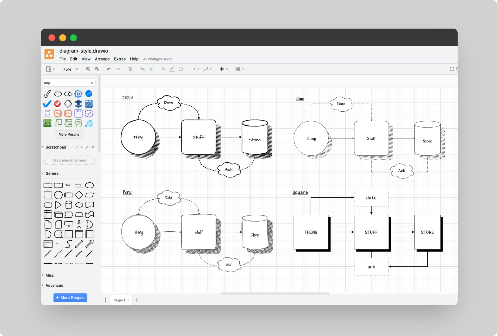

# Diagram Style Guide

An opinionated diagram style guide.

## Introduction

This guide will help you create *clear, straightforward, and consistent technical diagrams*. It's for anyone who needs to turn complex ideas into simple visuals—product managers, developers, project managers, and more.

I'm Ari, a professional with a background in cybersecurity, cloud consulting, and systems reliability engineering. I've honed my skills in explaining technical concepts to diverse audiences, and I've found that while text can often fall short, diagrams excel at quickly conveying complex ideas.

What I'm sharing in this guide are not abstract rules but practical tools that you can immediately apply to make complex information easy to understand. Throughout this guide I will be making use of [draw.io](draw.io), but the concepts shown can be implemented in any tool you wish to use. 

Now that we've set the stage let's dive into the practical tools and principles that will help you create clear, straightforward, and consistent technical diagrams. 

## General Principles

Technical diagrams should be simple. The simpler they are to understand without much background, the better. They're about showing technical ideas in a clear, accessible way. These guidelines are straightforward, giving you confidence in your diagram creation.

- **Consistency**: Stick to the same styles and rules in all your diagrams.

- **Clarity**: Aim for the most straightforward possible explanations.

- **Relevance**: Include only the information that matters. Keep diagrams neat and to the point.

## Shapes

Use basic shapes. Squares are straightforward and suitable for text. To differentiate services or logic, mix in other shapes. 

For creativity, try cubes for servers and cylinders for databases. Keep it simple.

## Arrows and Lines
### Directionality

Arrows and lines clarify data direction, request flow, or system connections. Consistency is key—choose a style and stick with it:

1. **Data Flow**: Arrow points where data goes. Example: From API to client.

2. **Action Flow**: Arrow shows action direction. Example: From client to API for data retrieval.

3. **System Connection**: Simple lines indicate interconnected systems without specifying direction. For example, a line connects the client and API but not the database if there's no direct communication.

### Line Style

- **Main Logic/Flow**: Use solid lines for primary connections (Client → API → Database).

- **Intermediate Logic/Flow**: Dashed lines for secondary details, like authentication steps.

> 
> Avoid multiple sharp turns in a single line; aim for straightforward paths.
> 

### Arrow Heads

- **General Flow**: Solid arrowheads for main actions or data flow.

- **Relationships/Notes**: Empty or basic arrowheads for connections, secondary logic, or annotations.

The rule isn't about your chosen style but about applying it consistently across your diagrams.

## Colour

You can keep diagrams simple with black, white, and grey for the main components. Use colour sparingly to emphasise key points. Remember, colours often carry subconscious meanings—red might suggest caution, an exception, or a change. Choose wisely to ensure clarity and avoid unintended interpretations; If in doubt, leave it out.

## Typography

Typography in technical diagrams conveys information and affects readability and comprehension. 

Here's how to approach it:
### Font Choices

- **Readability**: Select fonts that are easy to read. Sans-serif fonts like Arial, Helvetica, or Calibri are generally preferred for clarity, especially in digital formats.

- **Consistency**: Use the same font family throughout your diagrams to maintain consistency.

- **Availability**: Choose fonts widely available across different platforms and software to ensure your diagrams look the same everywhere.

### Text Size

- **Hierarchy**: Establish a clear hierarchy with your text sizes. Titles should be the largest, followed by subtitles (if any), captions, and body text. This helps guide the viewer's attention to the most critical parts of your diagram.

- **Legibility**: Ensure text is large enough to be easily legible on the intended display or print size. As a starting point, body text should be no smaller than 10 points for print and 12-14 points for screen displays.

### Labeling Conventions

- **Capitalisation**: Use capitalisation consistently. Decide if you will use sentence case, title case, or all caps for different types of text and stick to it throughout your diagrams.

- **Abbreviations**: If abbreviations are necessary, use them sparingly and consider including a legend or glossary if your diagram contains many. Ensure abbreviations are commonly understood or explained within the context.

- **Special Characters**: Use special characters (like arrows or symbols) consistently. Define what each symbol means if they're not universally recognised.

## Creativity and Aesthetics

When it comes to creativity and aesthetics, less is more. Simple design choices can help avoid overwhelming the viewer and distracting them from the main message in the diagram. 

Minimalism is Key:

- **Complexity Clutters**: Complex shapes, intricate patterns, and vibrant colours can distract and confuse. Stick to basic shapes and a limited colour palette. This ensures your diagrams remain focused on their primary purpose: efficiently conveying technical information.

- **Function Over Form**: Every element in your diagram should serve a purpose. If a creative detail doesn’t add to the Understanding of the diagram, it’s probably best left out. This isn’t to say your diagrams should be dull, but aesthetics should never overshadow functionality.
#### Why Less is More

- **Enhances Understanding**: A more straightforward diagram can be understood quickly and by a wider audience. It strips away the non-essential, allowing viewers to focus on the core information.

- **Facilitates Accessibility**: Limiting your use of colours and complex visuals makes your diagrams more accessible to individuals with visual impairments or colour blindness. This inclusivity broadens the reach and utility of your diagrams.

- **Compatibility**: Your diagram choices could impact your diagrams compatibility with other documentation. Your diagram might be needed in other peoples documentation.

#### How to Achieve Simplicity

- **Limit Colour Use**: Use colour sparingly to highlight or differentiate critical elements. Stick to a palette that’s visually distinct yet simple, avoiding colours that might blend together for colour-blind viewers.
    
- **Choose Clear, Simple Shapes**: Favour standard shapes like rectangles, circles, and arrows. These universally recognised symbols can convey a lot of information without additional complexity.
    
- **Avoid Decorative Fonts**: Use straightforward, sans-serif fonts for any text in your diagrams. These are easier to read, especially in smaller sizes, and maintain legibility across different platforms and devices.
    
- **Simplify Patterns and Lines**: Use solid lines for primary connections and dashed lines for secondary ones. Avoid using multiple line styles or patterns that make the diagram cluttered.

## Conventions and Best Practices
### Additional Tips

- **Contrast**: Ensure high contrast between text and background to improve readability. Dark text on a light background or light text on a dark background are both practical.

- **Spacing**: Pay attention to spacing around text. Avoid clutter by ensuring there is enough space around labels to make them easily distinguishable from each other.

- **Alignment**: Text alignment (left, centre, right) should be consistent across similar elements. Align text to shapes or lines to enhance the flow and readability of information.

### Naming Conventions

- **Files**: Adopt a transparent, descriptive naming system that reflects the diagram's purpose, version, and possibly the date of creation or modification (e.g., `NetworkArchitecture_V2.1_20240328`). This helps organize and locate files efficiently.

- **Diagram Elements**: Names should be concise yet descriptive enough to convey the element's function or role without ambiguity. For instance, a server might be labelled `AuthServer_EU` to indicate its purpose and location.

### Versioning of Diagrams

- **Sequential Versioning**: Use a version number to track revisions (e.g., 1.0, 1.1, 2.0). Increment the major number for significant changes and the minor for minor updates. This makes it easier to track changes over time and understand the evolution of a diagram.

> [!example] Example
>network-diagram-v1.0.5

- **Date-based Versioning**: Beneficial for frequently updated diagrams, incorporating the date (e.g., `2024-03-28`) can provide quick insight into the diagram's currency.

> [!example] Example
>network-diagram-20240328-1
>network-diagram-v1.0.5-20240328

- **Change Log**: You might want to maintain a change log within the diagram file or as an accompanying document to record the nature of each update, the date, and the author. This is invaluable for collaborative projects.

**Example**

| Name | Comment | Date | Version |
| ---------- | --------- | --------- | --------- | 
| Max | Added thing | 01/01/2024 | 1.2.0 | 
| Marie | Removed stuff | 16/11/2023 | 1.1.0|

### Reducing complexity

- **Modularity**: Break down complex diagrams into smaller, focused modules that can be understood independently. Link related diagrams or modules with references or hyperlinks where possible.

- **Layering**: Use layers to group diagram elements that belong to different aspects of the system (e.g., infrastructure, application, data flow). This allows viewers to focus on one layer at a time, reducing cognitive load.

- **Hide or Simplify Details**: Not every viewer needs to see every detail. Consider audience-specific versions of diagrams where less relevant details are omitted or simplified.

### Improving Legibility

- **Spacing and Alignment**: Ensure enough space between elements to avoid clutter. Align similar elements to create visual order and improve readability.

- **Highlight Key Elements**: Use colour, shading, or other visual means to draw attention to critical parts of the diagram, such as the primary data flow or components with special significance.

- **Consistent Scale and Orientation**: Maintain consistent scale across similar elements and a uniform orientation for the diagram to help viewers quickly grasp the layout and relationships.

- **Annotation and Legends**: Use annotations sparingly but effectively to clarify complex points. A legend can decode the diagram's symbols, colours, and line styles, aiding comprehension.

