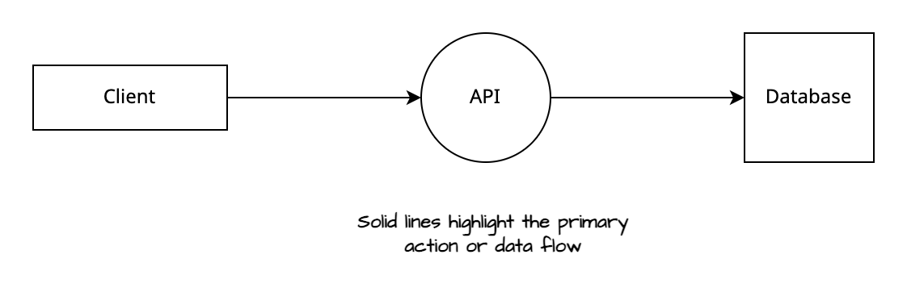

# Diagram Style Guide

An opinionated diagram style guide.

## Introduction

This guide provides practical principles and techniques for creating *clear, consistent, and effective technical diagrams*. Whether you're a product manager, developer, project manager, or technical professional, these guidelines will help you transform complex ideas into accessible visual communications.

Technical diagrams excel where text often falls short—they quickly convey complex relationships, system architectures, and process flows. The principles outlined here are actionable tools you can immediately apply to improve the clarity and impact of your technical communications.

While examples throughout this guide use [draw.io](https://draw.io), these concepts can be implemented in any diagramming tool you prefer. The focus is on universal principles that transcend specific software platforms. 

## General Principles

Effective technical diagrams prioritize clarity and understanding above all else. The goal is to communicate complex technical concepts in the simplest way possible, making them accessible to diverse audiences regardless of their technical background.

- **Consistency**: Maintain uniform styles, symbols, and conventions across all diagrams within a project or organization. This creates a cohesive visual language that readers can quickly learn and apply.

- **Clarity**: Choose the simplest representation that accurately conveys your message. Every element should have a clear purpose and contribute to overall understanding.

- **Relevance**: Include only essential information that directly supports your communication goal. Remove or minimize elements that don't add value to the viewer's understanding.

## Shapes

Use distinct shapes to differentiate between types of components or services in your diagrams. Simple geometric shapes work best as they're universally recognizable and easy to reproduce.

The specific shapes you choose matter less than maintaining consistency. Establish a shape vocabulary for your project—for example, if rectangles represent databases, use rectangles for all database components throughout your diagrams. This consistency helps viewers quickly identify component types and understand system relationships.

## Arrows and Lines
### Directionality

Arrows and lines communicate relationships, data flow, and system interactions. Choose a consistent approach and apply it throughout your diagrams:

1. **Data Flow**: Arrows indicate the direction data moves through the system. Example: Data flows from API to client.

2. **Action Flow**: Arrows show the direction of actions or requests. Example: Client initiates a request to the API.

3. **System Connection**: Simple lines without arrows indicate relationships or connections between systems without implying direction. Use this when systems interact bidirectionally or when direction isn't the focus.

### Line Style

Use different line styles to create visual hierarchy and distinguish between primary and secondary information:

- **Primary Flow**: Solid lines for main connections and critical paths (e.g., Client → API → Database).

- **Secondary Flow**: Dashed lines for supporting processes, optional connections, or auxiliary information (e.g., authentication flows, logging, monitoring).

### Line Angles

Keep line paths simple and clean to maintain diagram readability:

- Avoid unnecessary multiple sharp angles in a single line connection.

- Prefer direct, straightforward paths when connecting elements.

- When lines must intersect, maintain clear visual separation to prevent confusion.

### Arrow Heads

Use different arrowhead styles to convey different types of relationships:

- **Primary Actions**: Solid arrowheads for main actions, data flow, or critical processes.

- **Secondary Relationships**: Empty or outline arrowheads for supporting connections, notes, or optional flows.

- **Combined Styles**: Combine line styles with arrowhead styles to create a comprehensive visual language for different information types.

## Colour

You can keep diagrams simple with black, white, and grey for the main components. 

Use colour sparingly to emphasise key points. Remember, colours often carry subconscious meanings—red might suggest caution, an exception, or a change.

Choose wisely to ensure clarity and avoid unintended interpretations; If in doubt, leave it out.

## Typography

Typography in technical diagrams conveys information and affects readability and comprehension. 

### Font Choices

- **Readability**: Select fonts that are easy to read. Sans-serif fonts like Arial, Helvetica, or Calibri are generally preferred for clarity, especially in digital formats.

- **Consistency**: Use the same font family throughout your diagrams to maintain consistency.

- **Availability**: Choose fonts widely available across different platforms and software to ensure your diagrams look the same everywhere.

### Text Size

- **Hierarchy**: Establish a clear hierarchy with your text sizes. Titles should be the largest, followed by subtitles (if any), captions, and body text. This helps guide the viewer's attention to the most critical parts of your diagram.

- **Legibility**: Ensure text is large enough to be easily legible on the intended display or print size. As a starting point, body text should be no smaller than 10 points for print and 12-14 points for screen displays.

### Labeling Conventions

- **Capitalisation**: Use capitalisation consistently. Decide if you will use sentence case, title case, or all caps for different types of text and stick to it throughout your diagrams.

- **Abbreviations**: If abbreviations are necessary, use them sparingly and consider including a legend or glossary if your diagram contains many. Ensure abbreviations are commonly understood or explained within the context.

The below example demonstrates an inconsistent styling of labels and lack of convention.

What ever convention you decide on, stick to it. Below demonstrates how consistency ensures clarity.

## Creativity and Aesthetics

When it comes to creativity and aesthetics, less is more. Simple design choices can help avoid overwhelming the viewer and distracting them from the main message in the diagram. 

Minimalism is Key:

- **Complexity Clutters**: Complex shapes, intricate patterns, and vibrant colours can distract and confuse. Stick to basic shapes and a limited colour palette. This ensures your diagrams remain focused on their primary purpose: efficiently conveying technical information.

- **Function Over Form**: Every element in your diagram should serve a purpose. If a creative detail doesn’t add to the Understanding of the diagram, it’s probably best left out. This isn’t to say your diagrams should be dull, but aesthetics should never overshadow functionality.

- **Enhances Understanding**: A more straightforward diagram can be understood quickly and by a wider audience. It strips away the non-essential, allowing viewers to focus on the core information.

- **Facilitates Accessibility**: Limiting your use of colours and complex visuals makes your diagrams more accessible to individuals with visual impairments or colour blindness. This inclusivity broadens the reach and utility of your diagrams.

- **Compatibility**: Your diagram style choices could impact your diagrams' compatibility with other documentation. Your diagram might be needed in other people's documentation, so it is therefore important to consider what style is appropriate.

> **Style Examples**
> Check out the [style pack](diagram-styles.drawio) for [draw.io](draw.io) for some inspiration.

#### How to Achieve Simplicity

- **Limit Colour Use**: Use colour sparingly to highlight or differentiate critical elements. Stick to a palette that’s visually distinct yet simple, avoiding colours that might blend together for colour-blind viewers.
    
- **Choose Clear, Simple Shapes**: Favour standard shapes like rectangles, circles, and arrows. These universally recognised symbols can convey a lot of information without additional complexity.
    
- **Avoid Decorative Fonts**: Use straightforward, sans-serif fonts for any text in your diagrams. These are easier to read, especially in smaller sizes, and maintain legibility across different platforms and devices.
    
- **Simplify Patterns and Lines**: Use solid lines for primary connections and dashed lines for secondary ones. Avoid using multiple line styles or patterns that make the diagram cluttered.

## Conventions and Best Practices
### Additional Tips

- **Contrast**: Ensure high contrast between text and background to improve readability. Dark text on a light background or light text on a dark background are both practical.

- **Spacing**: Pay attention to spacing around text. Avoid clutter by ensuring there is enough space around labels to make them easily distinguishable from each other.

- **Alignment**: Text alignment (left, centre, right) should be consistent across similar elements. Align text to shapes or lines to enhance the flow and readability of information.

### Naming Conventions

- **Files**: Adopt a transparent, descriptive naming system that reflects the diagram's purpose, version, and possibly the date of creation or modification (e.g., `NetworkArchitecture_V2.1_20240328`). This helps organize and locate files efficiently.

- **Diagram Elements**: Names should be concise yet descriptive enough to convey the element's function or role without ambiguity. For instance, a server might be labelled `AuthServer_EU` to indicate its purpose and location.

### Versioning of Diagrams

- **Sequential Versioning**: Use a version number to track revisions (e.g., 1.0, 1.1, 2.0). Increment the major number for significant changes and the minor for minor updates. This makes it easier to track changes over time and understand the evolution of a diagram.

> [!example] Example
>network-diagram-v1.0.5

- **Date-based Versioning**: Beneficial for frequently updated diagrams, incorporating the date (e.g., `2024-03-28`) can provide quick insight into the diagram's currency.

> [!example] Example
>network-diagram-20240328-1
>network-diagram-v1.0.5-20240328

- **Change Log**: You might want to maintain a change log within the diagram file or as an accompanying document to record the nature of each update, the date, and the author. This is invaluable for collaborative projects.

**Example**

| Name | Comment | Date | Version |
| ---------- | --------- | --------- | --------- | 
| Max | Added thing | 01/01/2024 | 1.2.0 | 
| Marie | Removed stuff | 16/11/2023 | 1.1.0|

### Reducing complexity

- **Modularity**: Break down complex diagrams into smaller, focused modules that can be understood independently. Link related diagrams or modules with references or hyperlinks where possible.

- **Layering**: Use layers to group diagram elements that belong to different aspects of the system (e.g., infrastructure, application, data flow). This allows viewers to focus on one layer at a time, reducing cognitive load.

- **Hide or Simplify Details**: Not every viewer needs to see every detail. Consider audience-specific versions of diagrams where less relevant details are omitted or simplified.

### Improving Legibility

- **Spacing and Alignment**: Ensure enough space between elements to avoid clutter. Align similar elements to create visual order and improve readability.

- **Highlight Key Elements**: Use colour, shading, or other visual means to draw attention to critical parts of the diagram, such as the primary data flow or components with special significance.

- **Consistent Scale and Orientation**: Maintain consistent scale across similar elements and a uniform orientation for the diagram to help viewers quickly grasp the layout and relationships.

- **Annotation and Legends**: Use annotations sparingly but effectively to clarify complex points. A legend can decode the diagram's symbols, colours, and line styles, aiding comprehension.

